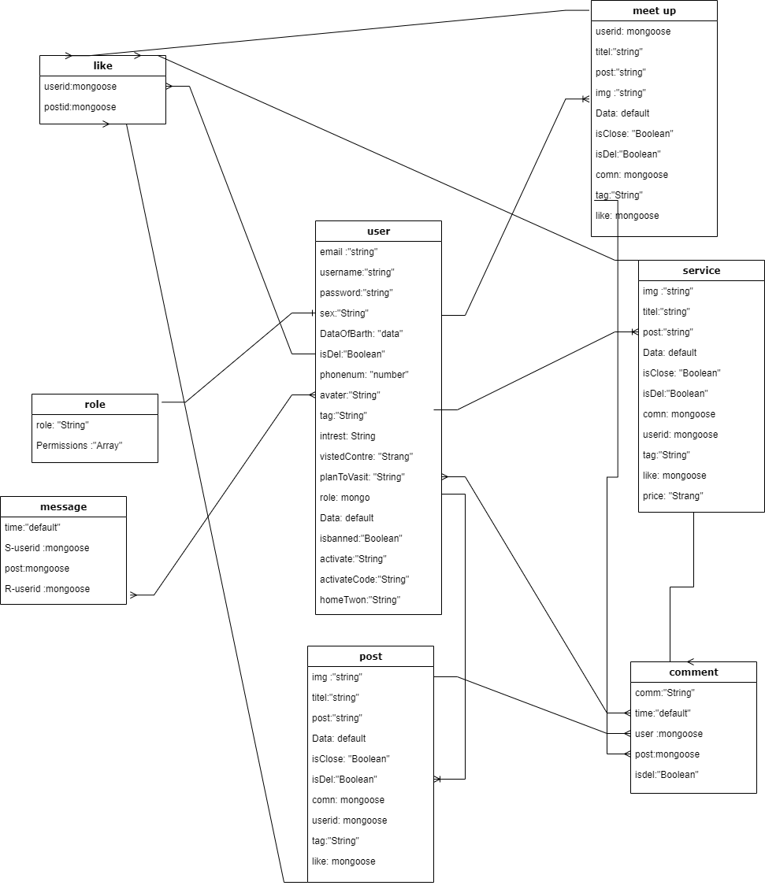
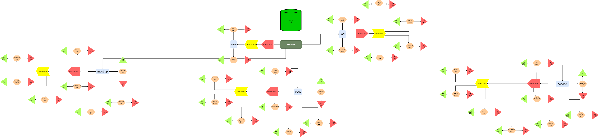

--------------
## Master Paece Project (TRAVELING ROAD)

(Name):the app focus on traveling and cultural exchange to make it essayer for the Tourists
to konw and the touristic places and historical places from Residents of the area ,
so the user can Post on the app his destination and ask about : what to do and not to do ,shops for necessities ,events can vists ,Restaurants...etc.
and the other users commint on the post to help or even arrange meeting to discover the plece together and make new friends .


## User Story 

- **Signup:**  user can sign up in the platform so that the user can start posts and reply to athers posts  
- **Login:**  user can login to the platform so that the user can see his oun posts and reply to the comments on  it 
- **Logout:** As a user I can logout from the platform so no one else can use my profile 
- **Add New Posts:** As a user I can post new post
- **Commint on posts:** As a user I can comment on all posts
- **Messages:** As a user I can seand private  messages to Another user 
- **Friend:** As a user I can add user to firends list and follow thers posts

## Admin Story 
- **Deleat posts:** As a Admin I can deleat any post  
- **Deleat Commint:** As a Admin I can deleat any Commint 
- **banned  user:** As a Admin I can banned any user from commint and post 

# Client / Frontend


# Server 

## Models

User model


| key        | type            | options          | default value |
| ---------- | --------------- | ---------------- | ------------- |
| username   | String          | required, unique | n/a           |
| email      | String          | required, unique | n/a           |
| password   | String          | required         | n/a           |
| Phonenumber| String          |  unique          | n/a           |
| SEX        | String          |   n/a            | n/a           |
| HomeTown   | String          |   n/a            | n/a           |
| Bio        | String          |   n/a            | n/a           |
| Avatar     | String          |   n/a            | n/a           |
| VistedContry| String         |   n/a            | n/a           |
| roles      | Schema <roles>  | required         | n/a           |
| isbanned   | Boolean         |   n/a            | false         |
| isdel      | Boolean         |   n/a            | false         |
| Activate   | Boolean         |   n/a            | false         |


User Schema

  ```
{
  username: {type: String, required: true, unique: true},
  email: {type: String, required: true, unique: true},
  password: {type: String, required: true},
  Phonenumber: {type: Number},
  HomeTown: {type: String},
  Sex: {type: String},
  Avatar : {type: String, required: true, default:},
  Bio: {type: String},
  VistedContry: {type: String},
  isdel: {type: boolean, default: false},
  isbanned: {type: boolean, default: false},
  rloe: {type: Schema.Types.ObjectId,ref:'Role'},
  Activate : {type: boolean, default: false},
}
```


Post model
| key        | type            | options          | default value |
| ---------- | --------------- | ---------------- | ------------- |
| Titel      | String          | required,        | n/a           |
| img        | String          |    n/a           | n/a           |
| post       | String          | required         | n/a           |
| date       | String          |  unique          | new Date()    |
| Comment    | Schema <comment>|    required      | n/a           |
| creator    |Schema <user>    |   required       | n/a           |
| like       |Schema <like>    |    n/a           | n/a           |
| tag        | String          |    n/a           | n/a           |
| isclose    | Boolean         |    n/a           | false         |
| isdel      | Boolean         |    n/a           | false         |

  Post Schema

```
 {
   Titel: {type: String, required: true},
   img: {type: String},
   post: {type: String, required: true},
   date: { type: String, default: new Date() },
   isdel: {type: boolean, default: false},
   isclose: {type: boolean, default: false},
   Comment: {type: Schema.Types.ObjectId,ref:'Comment'},
   creator: {type: Schema.Types.ObjectId,ref:'User'}
   like: {type: Schema.Types.ObjectId,ref:'Like'}
   tag: {type: String},


   
 }
```
meetup model
| key        | type            | options          | default value |
| ---------- | --------------- | ---------------- | ------------- |
| Titel      | String          | required,        | n/a           |
| img        | String          |    n/a           | n/a           |
| dese       | String          | required         | n/a           |
| date       | String          |  unique          | new Date()    |
| Comment    | Schema <comment>|    required      | n/a           |
| creator    |Schema <user>    |   required       | n/a           |
| like       |Schema <like>    |    n/a           | n/a           |
| tag        | String          |    n/a           | n/a           |
| isclose    | Boolean         |    n/a           | false         |
| isdel      | Boolean         |    n/a           | false         |
  
  
meetup Schema

```
 {
   Titel: {type: String, required: true},
   img: {type: String},
   dese: {type: String, required: true},
   date: { type: String, default: new Date() },
   isdel: {type: boolean, default: false},
   isclose: {type: boolean, default: false},
   Comment: {type: Schema.Types.ObjectId,ref:'Comment'},
   creator: {type: Schema.Types.ObjectId,ref:'User'}
   like: {type: Schema.Types.ObjectId,ref:'Like'}
   tag: {type: String},


   
 }
```
service model
| key        | type            | options          | default value |
| ---------- | --------------- | ---------------- | ------------- |
| Titel      | String          | required,        | n/a           |
| img        | String          |    n/a           | n/a           |
| dese       | String          | required         | n/a           |
| date       | String          |  unique          | new Date()    |
| price      | Number          |  required        | n/a           |
| Comment    | Schema <comment>|    required      | n/a           |
| creator    |Schema <user>    |   required       | n/a           |
| raet       |Schema <raet>    |    n/a           | n/a           |
| tag        | String          |    n/a           | n/a           |
| isclose    | Boolean         |    n/a           | false         |
| isdel      | Boolean         |    n/a           | false         |
  
  service Schema

```
 {
   Titel: {type: String, required: true},
   img: {type: String},
   dese: {type: String, required: true},
   date: { type: String, default: new Date() },
   price: {type: Number},
   isdel: {type: boolean, default: false},
   isclose: {type: boolean, default: false},
   Comment: {type: Schema.Types.ObjectId,ref:'Comment'},
   creator: {type: Schema.Types.ObjectId,ref:'User'}
   raet: {type: Schema.Types.ObjectId,ref:'Like'}
   tag: {type: String},


   
 }
```
## ERD



## Backend routes

| HTTP Method | URL            | Request Body                                                  | Success status | Error Status  | Permissions                |  Description                                                  |
| ----------- | -------------- | ---------------------------------------------------------- | -------------- | ------------ | --------------------------------|---------------------------- |
| GET         | `/login/:id`     | n/a                                                          | 200            | 404          |   public `<Route>`                |Check if user is logged in and return profile page           |
| POST        | `/signup` | {username, email, password}                                    | 201            | 404          |  public `<Route>`               | Checks if fields not empty (422) and user not exists (409), then create user with encrypted password, and store user in session |
| POST        | `/login`  | {email, password}                                         | 200            | 401          |  public `<Route>`               | Checks if fields not empty (422), if user exists (404), and if password matches (404), then stores user in session |
| POST        | `/logout` | n/a                                                      | 204            | 400          |  user only `<PrivateRoute>`               | Logs out the user                                            |
| GET         | `/post/:id`        | n/a | 200               | 404   |  public `<Route>`          |Used to get one post by id . |
| GET         | `/posts`         | n/a | 200               | 404     |  public `<Route>`        |Used to get all posts. |
| PUT         | `/post/:id`  | {username, img, titel, post, tag |  201           | 400      |  user only `<PrivateRoute>`    | Used to update one post by id                 |
| POST        | `/post/creta`| {username, img, titel, post, tag} | 201            | 400     |  user only `<PrivateRoute>`    | Used to create post , using current logged in user id as a creator. |
| DELETE      | `/post/:id`  |  n/a                                                        | 200            | 401    |  user and admin `<PrivateRoute>`      | Used to delete one post id                 |
| GET         | `/meetup/:id`   | n/a | 200               | 404    |  public `<Route>`         |Used to get one meetup by id|
| GET         | `/meetsup`        | n/a | 200               | 404    |  public `<Route>`         |Used to get all meetup. |
| PUT         | `/meetup/:id`  | {username, img, titel, post, tag,|  201           | 400   |  public `<Route>`       | Used to update one meetup by id .          |
| POST        | `/meetup/creta`| {username, img, titel, post, tag} | 201            | 400     |  user only `<PrivateRoute>`    | Used to create meetup , using current logged in user id as a creator. |
| DELETE      | `/meetup/:id`  |  n/a                                                       | 200            | 401   |  user and admin `<PrivateRoute>`       | Used to delete one meetup by id .            |
| GET         | `/service/:id`  | n/a | 200               | 404      |  public `<Route>`       |Used to get one service by id|
| GET         | `/services`       | n/a | 200               | 404      |  public `<Route>`       |Used to get all service. |
| PUT         | `/service/:id`  | {username, img, titel, post, tag,|  201           | 400     |  public `<Route>`     | Used to update one service by id .          |
| POST        | `/service/creta`| {username, img, titel, post, tag} | 201            | 400     |  user only `<PrivateRoute>`     | Used to create service , using current logged in user id as a creator. |
| DELETE      | `/service/:id`  | n/a                                             | 200            | 401    |  user and admin `<PrivateRoute>`      | Used to delete one service by id .            |

  ## UML


  ## Links
### Trello
[Link to your trello board](https://trello.com/mpprojecthaitham) 
### Git


[Client repository Link](https://github.com/MP-Project-Haitham/client)

[Server repository Link](https://github.com/MP-Project-Haitham/server)

[Deployed App Link](https://github.com/MP-Project-Haitham)
### Slides


[Slides Link](https://github.com/MP-Project-Haitham)
<<<<<<< HEAD
=======


>>>>>>> 038f73d31c77d2ab327d79b665693d599b329ea8
